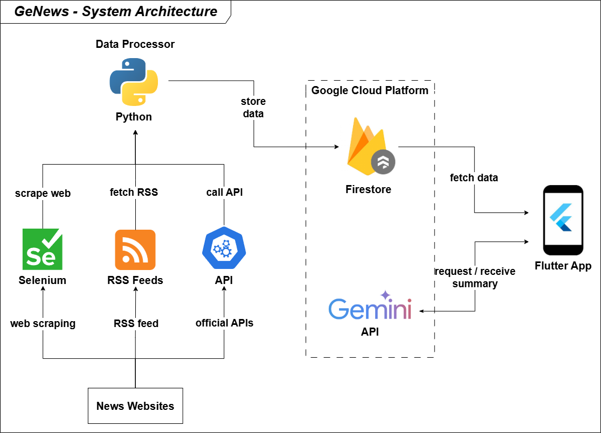

<div align="center" style="display: flex; align-items: center; justify-content: center; gap: 20px;">
   
   <h1 style="margin: 0;">GeNews - AI-Powered News Aggregator</h1>
</div>

## 🌟 Overview

**GeNews** is an intelligent, multi-platform news aggregator and summarizer built with Flutter and powered by Google's Gemini AI. The application provides users with AI-driven news summaries delivery across mobile platforms.

## 🏗️ System Architecture



### Architecture Overview

The GeNews system follows a microservices architecture with clear separation of concerns:

#### **Data Processing Layer (Python Backend)**

- **Web Scraping**: Automated content extraction using Selenium
- **RSS Integration**: Real-time RSS feed processing and aggregation
- **API Aggregation**: Integration with official news APIs
- **Data Pipeline**: Automated processing, enrichment, and storage of news articles

#### **Cloud Infrastructure (Google Cloud Platform)**

- **Firestore Database**: NoSQL storage for articles, bookmarks, and user data
- **Real-time Synchronization**: Instant updates across all client devices
- **Scalable Storage**: Efficient handling of large-scale news data

#### **AI Processing (Google Gemini)**

- **Summary Generation**: Automatic, structured news summarization in Vietnamese
- **Content Analysis**: Extracts key points, context, and insights from articles

#### **Client Application (Flutter)**

- **Cross-Platform UI**: Single codebase for all platforms
- **State Management**: Provider pattern for reactive UI updates
- **Real-time Updates**: Live data sync with backend
- **Advanced Search**: Full-text search with category filtering
- **Bookmark Management**: Save, organize, and manage favorite articles
- **Dark/Light Theme**: Automatic and manual theme switching
- **Customizable Font Sizes**: Accessibility-focused reading experience
- **Social Sharing**: Share news easily via native and web platforms
- **In-app WebView**: Read full articles with ad-blocking support

## 🚀 Key Features

### 🤖 AI-Powered Intelligence

- **Smart Summaries**: Gemini AI transforms lengthy articles into concise, structured content
- **Contextual Analysis**: Highlights key points, context, and implications

### 📱 Multi-Platform Support

- **Cross-Platform**: Native performance on iOS, Android, Web, Windows, macOS, and Linux

### 🎨 User Experience

- **Dark/Light Theme**: System and manual switching
- **Customizable Font Sizes**: For optimal readability
- **Advanced Search**: Search by keyword, category, and source
- **Bookmark Management**: Save and organize articles for later reading
- **Social Sharing**: One-tap sharing to social platforms

### 🌐 Content Aggregation

- **Multiple Sources**: RSS feeds, web scraping, and official APIs
- **Real-time Updates**: Live news feed with Firestore real-time sync
- **Vietnamese Language**: Localized content and interface
- **Category Management**: Organized by topics (Politics, Business, Sports, etc.)
- **Advanced Search**: Firestore-powered full-text search capabilities

## 🔄 Data Flow

1. **Python Scripts** (`python/` folder) fetch news from multiple sources
2. **Firestore** (`articles` collection) stores processed news articles
3. **Flutter App** retrieves data directly from Firestore
4. **Gemini AI** generates summaries on-demand with caching
5. **Real-time Updates** sync new articles across all devices

## 🛠️ Tech Stack

### Frontend

- **Flutter 3.x**: Cross-platform UI framework
- **Dart**: Primary programming language
- **Provider**: State management
- **WebView**: In-app web content rendering with ad-blocking
- **Cached Network Image**: Optimized image loading

### Backend & Data Processing

- **Python**: Data processing and web scraping
- **Selenium**: Automated web content extraction
- **RSS Parser**: Feed processing and aggregation
- **REST APIs**: External news source integration

### Cloud Services

- **Firebase/Firestore**: Real-time database and sync
- **Google Gemini AI**: Content analysis and summarization
- **Google Cloud Platform**: Infrastructure and hosting

## 📁 Project Structure

```
genews/
├── .env
├── .gitignore
├── .metadata
├── analysis_options.yaml
├── devtools_options.yaml
├── firebase.json
├── genews.iml
├── pubspec.lock
├── pubspec.yaml
├── README.md
├── android/           # Android-specific configuration
├── assets/            # Static resources (icons, images)
├── build/             # Build outputs (auto-generated)
├── ios/               # iOS-specific configuration
├── lib/               # Main Flutter/Dart source code
│   ├── core/          # Core utilities and constants
│   ├── features/      # Feature modules (news, bookmarks, settings, etc.)
│   ├── shared/        # Common widgets, styles, and utilities
│   └── main.dart      # Application entry point
├── linux/             # Linux desktop configuration
├── macos/             # macOS configuration
├── python/            # Backend data processing scripts
├── test/              # Unit and widget tests
├── web/               # Web deployment files
├── windows/           # Windows desktop configuration
└── .idea/             # IDE settings (for JetBrains IDEs)
```

## 🚀 Getting Started

### Prerequisites

- Flutter SDK (3.0 or higher)
- Dart SDK (3.0 or higher)
- Python 3.8+ (for backend processing)
- Firebase project setup
- Google Gemini API key

### Installation

1. **Clone the repository**

   ```bash
   git clone https://github.com/yourusername/genews.git
   cd genews
   ```

2. **Install Flutter dependencies**

   ```bash
   flutter pub get
   ```

3. **Configure Firebase**

   - Create a new Firebase project
   - Enable Firestore Database
   - Download `google-services.json` (Android) and `GoogleService-Info.plist` (iOS)
   - Place configuration files in respective platform directories

4. **Set up environment variables**

   ```bash
   # Create .env file in project root
   GEMINI_API_KEY=your_gemini_api_key
   FIREBASE_PROJECT_ID=your_firebase_project_id
   ```

5. **Install Python dependencies (for data fetching)**

   ```bash
   cd python
   pip install -r requirements.txt
   ```

6. **Run Python scripts to populate Firestore**
   ```bash
   cd python
   python main.py  # Fetch news from all sources
   ```

### Running the Application

```bash
# Debug mode
flutter run

# Specific platform
flutter run -d chrome          # Web
flutter run -d windows         # Windows
flutter run -d macos          # macOS
flutter run -d linux          # Linux
```

### Testing Migration

```bash
# In Flutter app, run migration test
MigrationTestService.testMigration()

# Or use the debug widget
const MigrationTestWidget()
```

<!-- #### Backend Services

```bash
cd python
python main.py
``` -->

## 🔧 Configuration

### Firebase Setup

1. Create a Firestore database
2. Configure security rules
3. Set up collections: `news`, `bookmarks`, `categories`

### API Configuration

- Configure news API endpoints in [`lib/core/constants.dart`](lib/core/constants.dart)
- Set up Gemini AI credentials
- Configure RSS feed sources

## 🤝 Contributing

1. Fork the repository
2. Create a feature branch (`git checkout -b feature/amazing-feature`)
3. Commit your changes (`git commit -m 'Add some amazing feature'`)
4. Push to the branch (`git push origin feature/amazing-feature`)
5. Open a Pull Request

## 👥 Authors

- **Hoang Nguyen Duy**

---
