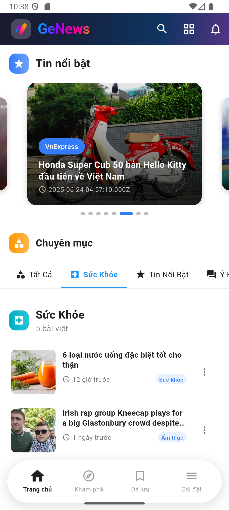
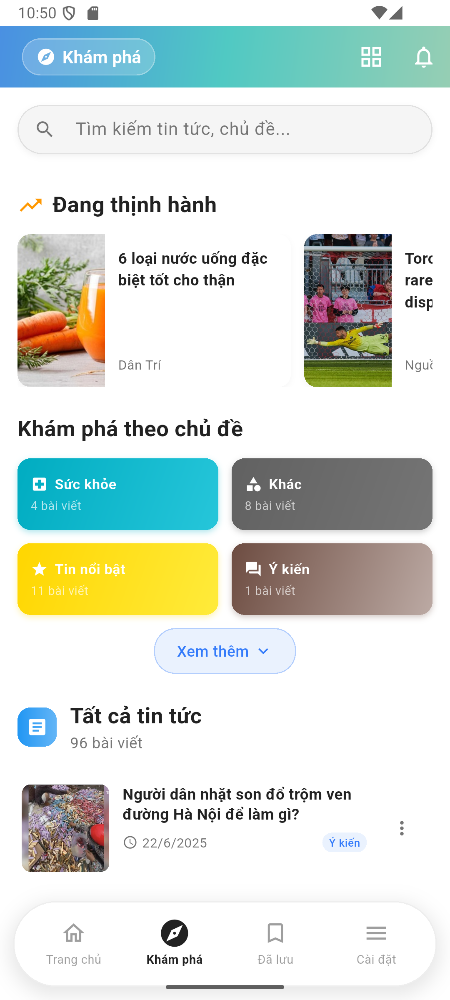
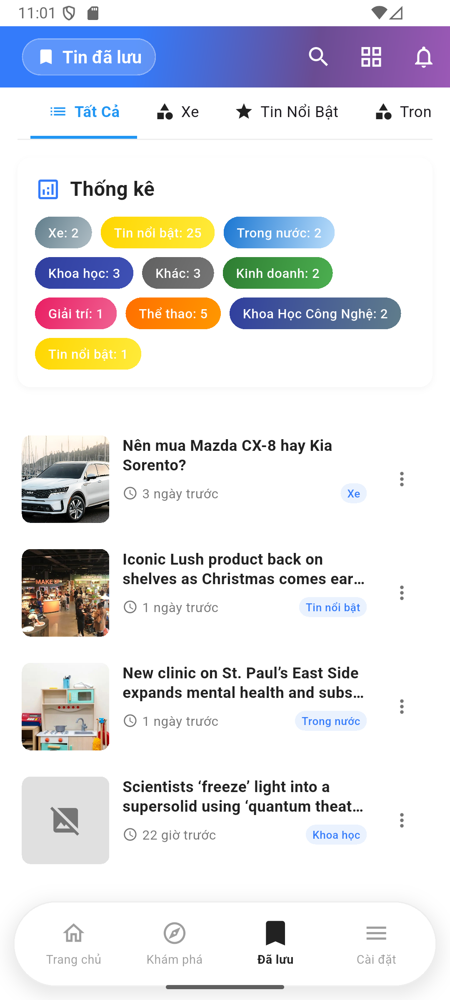
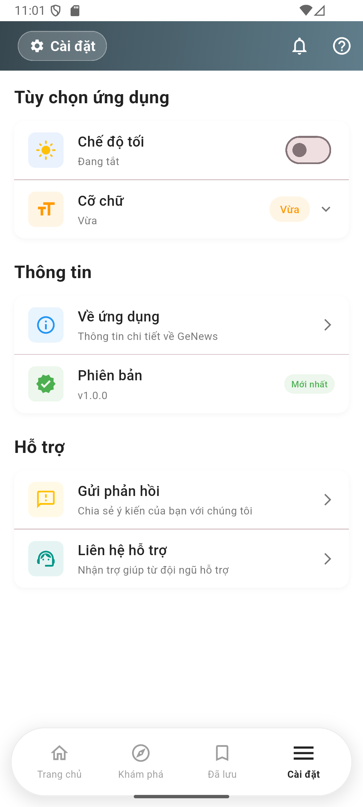

# GeNews - AI-Powered News Aggregator

<p align="center">
  
</p>

[](https://flutter.dev)
[](https://python.org)
[](https://firebase.google.com)
[](https://cloud.google.com/run)

---

## 🌟 Overview

**GeNews** is a cross-platform news aggregator powered by Flutter and Google Gemini AI. News is fetched automatically from APIs, RSS, and web scraping by Python scripts running in Docker on Google Cloud Run, then synced to Firestore for real-time access on all devices.

- **Multi-source news collection** (APIs, RSS, web scraping)
- **AI-powered summarization** (Google Gemini)
- **Real-time sync** (Firebase Firestore)
- **Modern, responsive Flutter client** (Android, iOS, Web, Windows, macOS, Linux)
- **Advanced features:** Search, smart bookmarking, ad-blocking, sharing, offline support

---

## 🏗️ System Architecture


### Main Components

- **Backend (Python, Docker, Cloud Run):**

  - Multi-source fetchers (APIs, RSS, Selenium web scraping)
  - Data pipeline: normalization, deduplication, error handling
  - Scheduled jobs (hourly, with retry)
  - Containerized with Docker, deployed on Google Cloud Run

- **Cloud Infrastructure:**

  - **Firestore:** Real-time NoSQL DB for articles
  - **Cloud Run:** Serverless backend for fetchers
  - **Google Gemini AI:** Summarization and content summary (invoked from Flutter)

- **Frontend (Flutter):**
  - Cross-platform UI (single codebase)
  - Provider for state management
  - Real-time updates, advanced search, ad-blocking, smart bookmarks

---

## 🚀 Key Features

- **AI Summarization:** Google Gemini-powered article summaries
- **Advanced Search:** Full-text, category/source filters, Vietnamese/English support
- **Smart Bookmarks:** Real-time sync, search/filter, cross-device
- **Ad-Blocking:** Intelligent, customizable ad-blocking in WebView
- **Modern UI/UX:** Responsive, dark/light mode, smooth animations
- **Offline Support:** Read saved articles without internet
- **Performance:** Smart caching, fast loading, robust error handling

---

## 🛠️ Technical Stack

- **Frontend:** Flutter 3.x (Dart), Provider, WebView, CachedNetworkImage, Share Plus, Shared Preferences
- **Backend:** Python 3.8+, Selenium, RSS Parser, NewsData API, BeautifulSoup
- **Cloud:** Docker, Google Cloud Run, Firebase Firestore
- **AI:** Google Gemini API

---

## 📁 Project Structure

```
genews/
├── lib/
│   ├── app/                # App config, themes, enums
│   ├── features/           # Feature modules (news, bookmarks, summary, main, settings)
│   │   ├── bookmarks/
│   │   ├── main/
│   │   ├── news/
│   │   ├── settings/
│   │   └── summary/
│   ├── shared/             # Shared services, utils, widgets
│   ├── main.dart           # App entry point
│   └── genews.dart         # Library export
├── python/                 # Backend fetchers & pipeline
│   ├── api_fetcher.py
│   ├── rss_fetcher.py
│   ├── selenium_fetcher.py
│   ├── base_fetcher.py
│   ├── main.py
│   ├── Dockerfile
│   └── requirements.txt
├── test/                   # Test utilities (screens, services, widgets)
├── assets/                 # Static resources (icons, splash, diagrams)
├── android/ ios/ web/ ...  # Platform configs
├── README.md
└── ... (build/config files)
```

---

## 📱 App Preview

> You can view more detailed app screenshots in the `assets/screenshots/` folder.

<p align="center">
  
  
  
  
  
  
</p>

---

## 🔧 Setup & Configuration

### Prerequisites

- Flutter 3.x+
- Python 3.8+
- Firebase project (Firestore enabled)
- Google Cloud account (Cloud Run enabled)
- Google Gemini API key

### Firebase Setup

1. Create Firebase project
2. Enable Firestore
3. Download `google-services.json` (Android) / `GoogleService-Info.plist` (iOS)
4. Set up collections: `articles`, `bookmarks`, `news_data`

### Cloud Run Setup

1. Enable Cloud Run & Cloud Build APIs
2. Deploy backend:
   ```bash
   cd python/
   gcloud run deploy genews-fetcher \
     --source . \
     --platform managed \
     --region asia-southeast1 \
     --allow-unauthenticated \
     --memory 2Gi \
     --cpu 2 \
     --timeout 3600 \
     --max-instances 1 \
     --set-env-vars DISPLAY=:99,FIREBASE_SERVICE_ACCOUNT_PATH=serviceAccountKey.json,NEWS_API_KEY=your_api_key,NEWS_COLLECTION=news_data,ARTICLES_COLLECTION=articles \
     --project your-project-id
   ```

### Local Development

- **Flutter:**
  ```bash
  flutter pub get
  flutter run
  ```
- **Python:**
  ```bash
  cd python/
  pip install -r requirements.txt
  python main.py  # Run once
  python main.py --schedule  # Run with scheduler
  ```

### Gemini AI

- Get API key from Google AI Studio
- Configure in Flutter app settings

---

## 🧑‍💻 Development Guidelines

- **Architecture:** Feature-based, clean separation of concerns
- **State Management:** Provider pattern
- **Code Style:** Follows Dart/Flutter and Python PEP8 conventions
- **Testing:** Unit, widget, and integration tests in `/test`
- **Security:** Do not commit secrets; use environment variables for API keys
- **Contributing:**
  - Fork & PR workflow
  - Write clear commit messages
  - Add/maintain tests for new features

---

## 🐞 Troubleshooting & FAQ

- **Build errors:** Ensure all dependencies are installed and Flutter/Python versions match requirements
- **Firestore issues:** Check Firebase rules and service account permissions
- **Cloud Run errors:** Check logs in Google Cloud Console
- **Gemini API issues:** Verify API key and quota

---

## 👤 Author

- **Hoang Nguyen Duy**

**Built with ❤️ using Flutter, Python, and AI Technologies**
