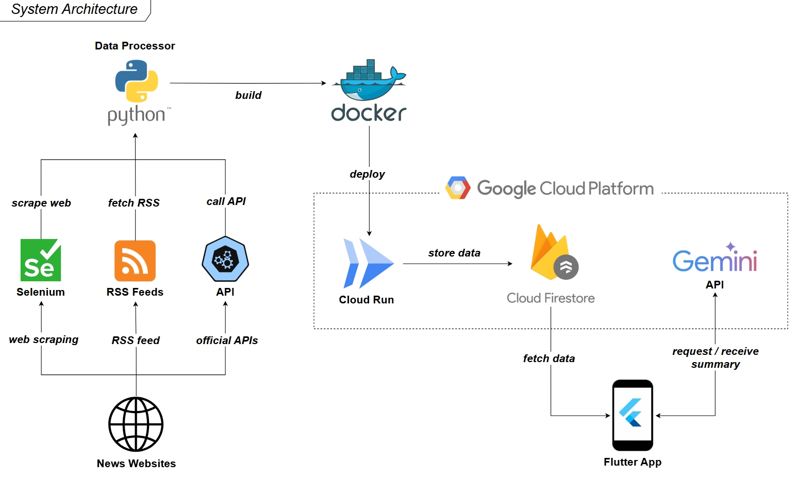

<div align="center" style="display: flex; align-items: center; justify-content: center; gap: 20px;">
   
   <h1 style="margin: 0;">GeNews - AI-Powered News Aggregator</h1>
</div>

## 🌟 Overview

**GeNews** is a cross-platform news aggregator and summarizer built with Flutter, powered by Google Gemini AI. The app fetches news from multiple sources, stores and syncs data in Firestore, and provides real-time updates, advanced search, bookmarking, sharing, and in-app reading with ad-blocking.

## 🏗️ System Architecture



### Main Components

- **Data Processing (Python Backend):**
  - Automated news collection from RSS, web scraping (Selenium), and official APIs
  - Preprocessing and normalization, storing articles in Firestore via scripts in [`python/`](python/)
- **Cloud Infrastructure (Firebase/Google Cloud):**
  - **Firestore Database:** Stores articles, bookmarks, and user data
  - **Realtime Sync:** Instant data updates across all devices
  - **Google Gemini AI:** Generates news summaries and content analysis (called directly from the Flutter app)
- **Flutter Application (Client):**
  - **Cross-platform UI:** Android, iOS, Web, Windows, macOS, Linux
  - **State Management:** Provider pattern
  - **Advanced Search:** Full-text search, filter by category/source
  - **Bookmarking:** Save, manage, and search saved articles
  - **Sharing:** Native and web sharing support
  - **WebView:** In-app reading with ad-blocking
  - **UI Customization:** Dark/Light mode, adjustable font size

## 🚀 Key Features

- **AI Summarization:** Automatic article summarization using Gemini AI, with caching for performance
- **Powerful Search:** Full-text search, filter by category/source, supports Vietnamese and English
- **Bookmark & Management:** Save, search, and filter bookmarks, synced across devices
- **Easy Sharing:** Share articles via popular platforms
- **Ad-blocking WebView:** Read original articles with automatic ad-blocking
- **Realtime Updates:** Instant news updates via Firestore realtime sync
- **UI Customization:** Dark/Light mode, adjustable font size, optimized reading experience

## 🛠️ Services & Technologies Used

- **Flutter 3.x** (Dart): Cross-platform UI
- **Firebase Firestore:** Storage, realtime sync
- **Google Gemini AI:** Summarization, content analysis
- **Python (Selenium, RSS Parser):** Data collection and processing
- **Provider:** State management
- **WebView:** In-app reading, ad-blocking
- **Cached Network Image:** Optimized image loading
- **Share Plus:** Native/web sharing
- **Custom UI:** Theme, font, pagination, etc.

## 📁 Project Structure

```
genews/
├── lib/               # Flutter/Dart source code
│   ├── core/          # Utilities, constants
│   ├── features/      # Features: news, bookmarks, settings, etc.
│   ├── shared/        # Shared widgets, styles, services
│   └── main.dart      # Entry point
├── python/            # Backend data processing scripts
├── assets/            # Icons, images, static resources
├── android/ ios/ ...  # Platform-specific configs
├── test/              # Unit/widget tests
└── ...
```

## 🔧 Setup & Configuration

- **Firestore:** Create a project, enable Firestore, set up rules, create `articles` collection
- **Gemini AI:** Obtain API key, configure in `.env`
- **Python:** Install dependencies, run scripts to populate Firestore

## 👥 Author

- **Hoang Nguyen Duy**

---
